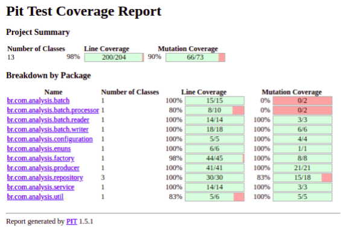

# Data Analysis System [](https://github.com/DiovaneMendes/data-analysis-system/actions/workflows/gradle.yml)
Serviço batch dedicado a leitura de arquivos ```.dat``` que geram ao final um relatório de vendas.

## Requisitos:
- Java 11
- Gradle
- Docker

## Métricas de qualidade
### Sonarqube
- Para subir o container:</br>
  ```docker-compose up```</br></br>

- Para executar relatório:</br>
  ```./gradlew clean test sonarqube```</br></br>

- Para o acesso: http://localhost:9000/ <br></br>

- Imagem da última execução na data de 01/05/2021:</br>


### Pitest
- Para gerar relatório:</br>
  ```./gradlew clean test pitest```</br></br>

- Imagem da última execução na data de 01/05/2021:</br>



## Formatação de Código
### Spotless

Este batch utiliza a lib [Spotless](https://github.com/diffplug/spotless) para automatizar sua formatação de código.</br>
Caso não tenha feito a execução do spotless (```./gradlew spotlessApply```), irá quebrar build e consequentemente não passará no CI.